# 锦书（JinShu）

云中谁寄锦书来

[](https://www.rust-lang.org/)
[](https://github.com/gengteng/jinshu/blob/main/LICENSE)

[](https://deps.rs/repo/github/gengteng/jinshu)
[](https://github.com/gengteng/jinshu/actions/workflows/ci.yml)
[](https://coveralls.io/github/gengteng/jinshu?branch=main)

----

**开发中！Work In Progress!**

构建一个高性能、稳定、可定制、易于部署的包含前后端的跨平台即时通讯系统。

服务端可以在 Linux、Windows、Mac 上编译运行（后两个主要用于开发）。

客户端支持 Windows/Mac/Linux/iOS/Android/Web/Electron/Flutter。

----

## 编译运行

### 使用Docker运行

请确保已安装：
* Git
* Docker
* docker-compose

在命令行执行:

```shell
# 克隆仓库
$ git clone https://github.com/gengteng/jinshu.git
$ cd jinshu
# 编译并生成镜像
$ docker build -t jinshu .
# 运行所有节点
$ docker-compose -f docker-compose.yml up -d --build
```

注意：Kafka 的 topic 创建可能较慢，导致 pusher、storage 消费节点异常退出，请在 topic 创建完成后重启这些节点。

### 本地编译运行

### 编译

请确保已安装:
  * Git
  * Rust 编译环境（参见 [Install Rust](https://www.rust-lang.org/tools/install) ）
  * CMake 及 C++ 编译器（用于编译 rdkafka)
  * rustfmt

在命令行执行：

```shell
$ git clone https://github.com/gengteng/jinshu.git
$ cd jinshu
$ cargo build # 生产环境需加上 --release 参数
```

#### 环境及配置

1. etcd
2. Redis
3. Apache Kafka / Apache Pulsar
4. PostgreSQL / MySQL
5. MongoDB

注：具体配置请参考 `conf/all.toml`。

#### 运行

服务端各模块启动顺序参考架构图或 `docker-compose.yml` 文件。

各服务端模块使用方法：

```text
USAGE:
    jinshu-xxxx [OPTIONS]

OPTIONS:
    -c, --configs <CONFIGS>...                   模块配置文件，支持多个文件，用空格分隔
    -h, --help                                   Print help information
    -r, --config-root-path <CONFIG_ROOT_PATH>    配置文件路径，配置文件会从该路径寻找

```

配置文件支持 json / toml / yaml 等多种格式，参见 [config](https://crates.io/crates/config) 文档。

例如，要使用 `./conf` 目录下 `etcd.toml`、`log.toml`、`receiver.toml` 三个配置文件启动 `jinshu-receiver` 模块，可执行以下命令：

```shell
$ ./target/debug/jinshu-receiver -r ./conf -c receiver log etcd
```

要使用 `./conf` 目录下的 `all.toml` 配置文件启动 `jinshu-authorizer` 模块，可执行以下命令：

```shell
$ ./target/debug/jinshu-authorizer -c ./conf/all
```

如果多个配置文件中有 **重复配置项**，则 **优先以排在前面的文件中的配置项为准** 。

----

## 启动验证

启动 app-server 后，可执行以下脚本进行验证：

```shell
# 注册两个用户，返回结果不用记录
$ curl --location --request POST 'http://localhost:8765/sign_up' \
--header 'Content-Type: application/json' \
--data-raw '{
    "username": "user1",
    "password": "1qaz2wsx"
}'

$ curl --location --request POST 'http://localhost:8765/sign_up' \
--header 'Content-Type: application/json' \
--data-raw '{
    "username": "user2",
    "password": "1qaz2wsx"
}'

# 登录两个用户，分别记录返回的 JSON 中的 jinshu 对象中的 user_id 和 token
$ curl --location --request POST 'http://localhost:8765/sign_in' \
--header 'Content-Type: application/json' \
--data-raw '{
    "username": "user1",
    "password": "1qaz2wsx"
}'

$ curl --location --request POST 'http://localhost:8765/sign_in' \
--header 'Content-Type: application/json' \
--data-raw '{
    "username": "user2",
    "password": "1qaz2wsx"
}'

# 使用 jinshu-cli 登录 user1，每秒发送一条消息给 user2
$ ./target/debug/jinshu-cli -u <user1_id> -t <user1_token> -r <user2_id>

# 启动另一个控制台，使用 jinshu-cli 登录 user2，每秒发送一条消息给 user1
$ ./target/debug/jinshu-cli -u <user2_id> -t <user2_token> -r <user1_id>

# 查看 jinshu-cli 发送及接收消息的输出，以及 comet、receiver、authorizer、distributor 的日志
```

## 功能模块

### 库（lib）

* 🔲 **jinshu-protocol**: 协议模块，包括前后端共用的协议、接口等
  * 🔲 TCP 私有协议
    * ✅  使用 [Codec(u8) | Length(u24) | Body([u8; Length])] 的报文格式
    * ✅  支持多种格式:
      * ✅  0.JSON
      * ✅ 1.MessagePack
      * ✅ 2.CBOR
      * ✅ 3.FlexBuffers
    * 🔲 支持 TLS（crate: rustls）
  * 🔲 支持 Websocket（crate: tungstenite/tokio-tungstenite）
    * 🔲 支持 TLS
  * 🔲 支持 QUIC（crate: quinn）
* 🔲 **jinshu-sdk**: 客户端 SDK 核心
  * 🔲 Rust SDK
  * 🔲 命令行聊天工具: jinshu-cli
  * 🔲 跨平台
    * 🔲 移动端（crate: uniffi)
      * 🔲 Android（crate: ndk、android_logger）
      * 🔲 iOS
    * 🔲 PC端（crate: cbindgen）
      * 🔲 Windows
      * 🔲 Mac
      * 🔲 Linux
    * 🔲 Electron（crate: neon）
    * 🔲 Web（crate: wasm-bindgen）
    * 🔲 Flutter（crate: flutter_rust_bridge）
* 🔲 **jinshu-common**: 服务端公共模块
  * ✅ 配置接口定义及读取
* 🔲 **jinshu-tracing**: 日志、跟踪相关
  * 🔲 日志、跟踪
    * ✅ 配置读取
    * ✅ 标准输出
    * ✅ 文件输出
    * 🔲 OpenTelemetry
* 🔲 **jinshu-redis**: Redis、用户Session相关
  * ✅ Redis 配置
  * 🔲 Session 管理
* 🔲 **jinshu-database**: 数据库相关
  * ✅ Model 定义/生成（crate: sea-orm-cli)
  * 🔲 ...
* 🔲 **jinshu-queue**: 消息队列相关
  * ✅ 配置定义
  * 🔲 消息队列支持
    * ✅ Apache Kafka（crate: rdkafka）
    * 🔲 Apache Pulsar（crate: pulsar）
    * 🔲 NATS （crate: nats）
    * 🔲 AMQP （crate: lapin）
* 🔲 **jinshu-rpc**: 定义服务端各模块间 RPC 调用的协议
  * ✅ 使用 gRPC 框架（crate: tonic）
  * 🔲 服务注册/发现
    * ✅ 服务注册、发现、监听接口定义
    * ✅ etcd
    * 🔲 zookeeper
    * 🔲 nacos
    * ✅ mock
  * ✅ 软负载均衡
  * 🔲 所有模块的服务定义
* 🔲 **jinshu-utils**: 工具方法

### 可执行程序（bin）

* 🔲 [C], **jinshu-comet**: 长链接保持模块，收发消息
  * ✅ 监听连接并收发报文
  * ✅ 登录验证
  * 🔲 心跳保持
* 🔲 [A], **jinshu-api**: SDK服务端接口模块（crate: axum）
  * 🔲 ...
* 🔲 [R], **jinshu-receiver**: 接收模块，接受消息并入队
  * 🔲 消息入队
    * ✅ Apache Kafka（crate: rdkafka）
    * ✅ Apache Pulsar（crate: pulsar）
    * 🔲 NATS （crate: nats）
    * 🔲 AMQP （crate: lapin）
* 🔲 [G], **jinshu-gateway**: 系统接入模块，对外系统的接口（crate: axum）
  * 🔲 App 服务端 Demo
    * ✅ 用户密码 Hash（crate: argon2）
  * ✅ 用户注册接口
  * ✅ 用户查询接口
  * ✅ 用户登录接口
  * ✅ 用户登出接口
  * 🔲 联机推送接口
  * 🔲 批量推送接口
* 🔲 [F], **jinshu-file**: 文件存取模块
  * 🔲 文件类型、大小校验
  * 🔲 文件转存（支持 MinIO，crate: rust-s3）
  * 🔲 文件访问（crate: axum）
* 🔲 [P], **jinshu-pusher**: 推送模块，将消息推送至 jinshu-comet
  * ✅ 连接状态查询（crate: redis)
* 🔲 [S], **jinshu-storage**: 存储模块，将消息存储至数据库
  * 🔲 数据库（crate: sea-orm）
    * 🔲 PostgreSQL
    * 🔲 MySQL
    * 🔲 MongoDB（crate: mongo）
* ✅ [U], **jinshu-authorizer**: 授权模块 
  * ✅ Redis 验证 token
* 🔲 [T], **jinshu-timer**: 定时任务
  * 🔲 ...
* 🔲 [M], **jinshu-admin**: 管理端及控制台（crate: axum）
  * 🔲 监控
  * 🔲 用户管理
  * 🔲 消息管理
  * 🔲 外接系统管理
----

## 架构图



## 可供参考的开源系统

* [OpenIM](https://github.com/OpenIMSDK)
* [goim](https://github.com/Terry-Mao/goim)
* [CIM](https://github.com/crossoverJie/cim)
* [TeamTalk](http://www.52im.net/thread-777-1-1.html)
* [Conduit](https://git.koesters.xyz/timo/conduit)

----
## 参考资料

### 即时通讯
* [即时通讯网](http://www.52im.net)
* [如何选择即时通讯应用的数据传输格式](http://www.52im.net/thread-276-1-1.html)
* [Serde](https://serde.rs/)
* [浅谈IM系统的架构设计](http://www.52im.net/thread-307-1-1.html)
* [一套原创分布式即时通讯(IM)系统理论架构方案](http://www.52im.net/thread-151-1-1.html)
* [基于Netty的新手教程](http://www.52im.net/thread-2768-1-1.html)

### Rust

* [A learning journal](https://www.lpalmieri.com/)
* [gRPC load balancing in Rust](https://truelayer.com/blog/grpc-load-balancing-in-rust)